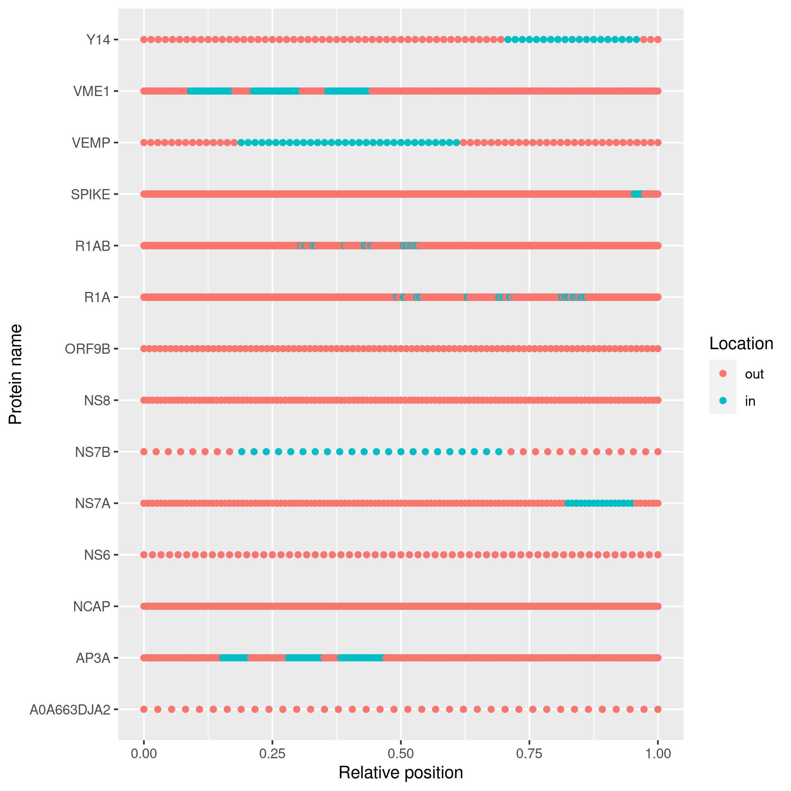

# `pureseqtmr`

[](https://cran.r-project.org/package=pureseqtmr)
[]( https://CRAN.R-project.org/package=pureseqtmr)
[](https://CRAN.R-project.org/package=pureseqtmr)

Branch   |[](https://travis-ci.org)                                                                      |[](https://appveyor.com)                                                                                                                |[](https://www.codecov.io)
---------|------------------------------------------------------------------------------------------------------------------------------------------|-----------------------------------------------------------------------------------------------------------------------------------------------------------------------------------|------------------------------------------------------------------------------------------------------------------------------------------------------------------------
`master `|[](https://travis-ci.org/richelbilderbeek/pureseqtmr) |[](https://ci.appveyor.com/project/richelbilderbeek/pureseqtmr/branch/master)  |[](https://codecov.io/github/richelbilderbeek/pureseqtmr/branch/master)
`develop`|[](https://travis-ci.org/richelbilderbeek/pureseqtmr)|[](https://ci.appveyor.com/project/richelbilderbeek/pureseqtmr/branch/develop)|[](https://codecov.io/github/richelbilderbeek/pureseqtmr/branch/develop)

R package to work with PureseqTM.

Because PureseqTM only works on Linux, `pureseqtmr` only works on Linux.

## Example

```r
library(pureseqtmr)

# Use an example proteome
fasta_filename <- system.file(
  "extdata", 
  "UP000464024.fasta", 
  package = "pureseqtmr"
)

# Predict the topology
topology <- predict_topology(fasta_filename)

# Simplify the protein names
topology$name <- stringr::str_match(
  string = topology$name,
  pattern = "..\\|.*\\|(.*)_SARS2"
)[,2]

# Plot the topology
plot_topology(topology)
```



## Install

Install the package:

```
remotes::install_github("richelbilderbeek/pureseqtmr")
```

Install PureseqTM to a default folder:

```
pureseqtmr::install_pureseqtm()
```

## There is a feature I miss

See [CONTRIBUTING](CONTRIBUTING.md), at `Submitting use cases`

## I want to collaborate

See [CONTRIBUTING](CONTRIBUTING.md), at 'Submitting code'

## I think I have found a bug

See [CONTRIBUTING](CONTRIBUTING.md), at 'Submitting bugs' 

## There's something else I want to say

Sure, just add an Issue. Or send an email.

## External links

 * [PureseqTM GitHub repo](https://github.com/PureseqTM/pureseqTM_package)
 * [PureseqTM server](http://pureseqtm.predmp.com/)

## References

Article about `PureseqTM`:

 * Wang, Qing, et al. "Efficient and accurate prediction of transmembrane topology from amino acid sequence only." bioRxiv (2019): 627307.

